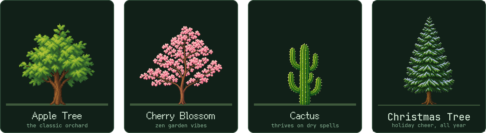

# Token Forest 🌳

**Every AI token you spend grows a tree on your desktop.**

[English](README.md) · [简体中文](README.zh-CN.md)

---

## What is Token Forest?

If you code with AI every day, you burn through millions of tokens — and all of it vanishes into a number on a billing page. **Token Forest turns that invisible effort into something alive.**

A small patch of soil appears in the corner of your screen, just above the taskbar. As you work with **Claude Code** or **Codex**, the tokens you spend feed a pixel tree that grows — seed, sprout, sapling, all the way to a full tree heavy with fruit. Work hard, and your desktop slowly becomes a forest.

It's a desktop pet for the AI-coding era: quiet, cozy, and always a glance away.

> 🖥️ **[Visit the website →](https://www.tokenforest.com.au)** — downloads, global leaderboard, and more.

---

## ✨ Features

### 🌱 A tree that grows as you work

Token Forest reads the token usage that Claude Code and Codex already record locally on your machine, in real time. Every conversation feeds your tree through **8 growth stages** — no clicking, no chores, it just grows while you build.

### 🌸 Four species, each with its own world

Grow and switch between **four species — Apple Tree, Cherry Blossom, Cactus, and the new Christmas Tree** — each with its own fruit, its own set of stage names, and themed decorations you earn and equip: torii gates, stone lanterns, wind chimes, bamboo fences, swings, string lights and more. Each species unlocks the next as you harvest its fruit.

> 🎄 **The Christmas Tree has arrived.** The holiday species just took root — hang ornaments, string the lights, and trim it all the way to *Christmas Splendor*. And a fifth species is already sprouting in our greenhouse…

### 🍎 Fruit, harvests, and a tiny shop

Mature trees bear fruit over time. Click to harvest, then spend your harvest in the shop to unlock decorations and customize your patch of the world.

### 💬 Live token bubbles

Floating bubbles pop up above the tree showing tokens flowing in — one bubble per conversation, color-coded by source, with a satisfying bounce every time the number climbs.

### 💊 Capsule mode

Big tree covering your work? Switch to a Dynamic-Island-style capsule: a tiny pill hugging the corner of your screen that shows which engine is running and whether it's done — hover for the full details, one click to bring the tree back.

### 🏆 Global leaderboard (opt-in)

Feeling competitive? Opt in to the [global leaderboard](https://www.tokenforest.com.au) and see how your forest ranks worldwide — every player's own tree, flagged by region, lined up side by side and ranked by the tokens they've grown. Strictly opt-in: only your nickname, region, current species, tree total and growth stage are submitted — and opting out removes your entry completely.

### 📊 Dashboard — feature-complete, shipping next

A report card for your forest: days planted, lifetime tokens, a growth curve over time, per-model breakdowns for Claude and Codex, a 26-week activity heatmap, per-project splits, and one honest line per conversation — with a cost estimate computed **offline** from a built-in price table (four token classes priced separately, cache reads at 0.1×).

### And the quality-of-life details

- **Featherweight** — a native desktop widget, not a game engine. Starts fast, sips resources.
- **Stays out of your way** — drag anywhere, snap to the corner, lock position, always-on-top toggle, launch at startup, hide/show in one click.
- **Poke your tree** — click it. It wiggles. That's it. It's great.
- **Speaks your language** — app **and** website in English, 中文, 日本語 and 한국어.

---

## 🔒 Privacy by design

Token Forest is built on one rule: **what happens on your machine stays on your machine.**

| Token Forest does | Token Forest never |
| --- | --- |
| Read the token **counts** from usage logs that Claude Code / Codex already keep locally | Read your code, prompts, or conversation content |
| Compute growth, stats and costs entirely on-device | Send telemetry or analytics anywhere |
| Store its state in small local files | Talk to the network at all — unless you opt in to the leaderboard |
| (Leaderboard, opt-in only) submit nickname, region, current species, tree total, growth stage | Upload anything else, ever |

Read the full [privacy notes](docs/PRIVACY.md).

---

## 📥 Get Token Forest

Token Forest is in **public beta** and free to use.

- **Download** — grab the latest Windows / macOS build from [tokenforest.com.au](https://www.tokenforest.com.au)
- **Requirements** — Windows 10/11 or macOS; [Claude Code](https://claude.com/claude-code) and/or Codex installed (that's where the tokens come from!)

⭐ **Star this repo** to follow releases and the next 🌲 species reveal.

---

## 🗺️ Roadmap

The short version — see the full [roadmap](docs/ROADMAP.md) for details.

| | |
| --- | --- |
| ✅ Shipped | Live token tracking (Claude Code + Codex) · 8-stage growth · **4 species (incl. 🎄 Christmas Tree)** with decorations · fruit & shop · bubbles · capsule mode · opt-in leaderboard · Windows & macOS · English / 中文 / 日本語 / 한국어 |
| 🚧 In progress | Stats dashboard (feature-complete) · one-click installers · **🌲 the next species** |
| 🔭 Next | Seasons & day/night · offline catch-up growth · achievements & streaks · more species, decorations and supported AI tools |

---

## ❓ FAQ

**Does it read my code?**

No. It reads token *counts* from local usage logs — never file contents, prompts, or conversations. See [privacy notes](docs/PRIVACY.md).

**Does it need the internet?**

No. Everything works fully offline. The only optional network feature is the leaderboard, which is off until you turn it on.

**Why is my token number so big?**

Token Forest counts all four token classes (input, output, cache read, cache write) — the same way usage dashboards do. Cache reads dominate for agentic tools, so the totals climb fast. The dashboard's cost view weighs each class by its real price, so the money number stays honest.

More in the full [FAQ](docs/FAQ.md).

---

## 👥 Team

Token Forest is built by a small team that spends *way* too many tokens — which is how we know the tree grows.

| | Name | GitHub | Email |
| --- | --- | --- | --- |
|  | **Eric Cheng** | [@Ericcccccc777](https://github.com/Ericcccccc777) | — |
|  | **Yiming (Miles) Ren** | [@YimingRen111](https://github.com/YimingRen111) | — |
|  | **Ethan Ma** | [@EthanMa727](https://github.com/EthanMa727) | [ethan727@proton.me](mailto:ethan727@proton.me) |

---

## 📬 Contact

- 🌐 Website — [www.tokenforest.com.au](https://www.tokenforest.com.au)
- ✉️ Email — [contact@tokenforest.com.au](mailto:contact@tokenforest.com.au)
- 🐛 Bugs & ideas — [open an issue](../../issues/new/choose)
- 🔐 Security — see [SECURITY.md](SECURITY.md)

---

## 🧾 About this repository

This is the **product home** for Token Forest: announcements, documentation, roadmap, and community feedback all live here. The application's **source code is developed in a private repository** and is not open source at this time — we're exploring opening core components (such as the local usage reader) in the future so our privacy claims can be independently verified.

What we'd love from you here: [bug reports](../../issues/new/choose), feature ideas, and screenshots of your forest. See [CONTRIBUTING.md](CONTRIBUTING.md).

---

© 2026 the Token Forest team. All artwork and branding are all rights reserved — see [LICENSE.md](LICENSE.md).

🌳 *May your context be long and your forest ever green.*

