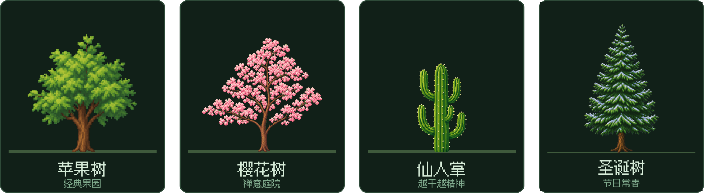

# Token Forest 🌳

**你花掉的每一个 AI token，都会在桌面上长成一棵树。**

[English](README.md) · [简体中文](README.zh-CN.md)

---

## Token Forest 是什么？

每天用 AI 写代码的人，一天要烧掉上百万 token——而这些消耗只是账单页面上一闪而过的数字。**Token Forest 把这份看不见的努力，变成一个活生生的东西。**

启动后，屏幕角落、任务栏上方会出现一小块土壤。你照常用 **Claude Code** 或 **Codex** 干活，花掉的 token 会喂养一棵像素树，让它从种子、发芽、树苗，一路长成挂满果实的大树。干得越多，你的桌面就慢慢变成一片森林。

这是属于 AI 编程时代的桌宠：安静、治愈、抬眼就能看到。

> 🖥️ **[访问官网 →](https://www.tokenforest.com.au)** —— 下载、全球排行榜等。

---

## ✨ 功能

### 🌱 一棵随工作自动生长的树

Token Forest 实时读取 Claude Code / Codex 在你本机留下的用量记录。每一次对话都会喂养你的树，走过 **8 个成长阶段**——不用点击、不用打理，你只管写代码，它自己长。

### 🌸 四个树种，各有各的世界

在**四个树种——苹果树、樱花树、仙人掌，以及全新的圣诞树**之间成长与切换。每种树都有自己的果实、自己的一套阶段名，以及可获得和装备的专属主题装饰：鸟居、石灯笼、风铃、竹篱笆、秋千、彩灯等等。收获当前树的果实，就会解锁下一个树种。

> 🎄 **圣诞树已登场。** 节日树种刚刚扎根——挂上彩球、缠好彩灯，一路装点到「圣诞盛装」。而第五个树种，已经在温室里悄悄发芽……

### 🍎 果实、收获和小商店

成熟的树会随时间结出果实。点击收获，再用收获在商店里解锁装饰，把你的小天地布置成自己的样子。

### 💬 实时 token 气泡

树的上方会浮出气泡，实时显示涌入的 token——一次对话一个气泡，颜色区分来源，数字每次上涨都会欢快地弹一下。

### 💊 胶囊模式

大树挡住工作窗口了？一键切换成"灵动岛"式胶囊：一枚贴在屏幕角落的小药丸，显示哪个引擎在跑、跑完了没——悬停看完整信息，一键换回大树。

### 🏆 全球排行榜（自愿加入）

想比一比？加入[全球排行榜](https://www.tokenforest.com.au)，看看你的森林在全世界排第几——榜上把每个人自己的树按地区插旗、一字排开，按养出的 token 总量排名。完全自愿：App 内的同意弹窗会列出同步的全部字段——匿名 ID、昵称、地区、各树 token 总量与成长阶段——退出排行榜时会从榜上删除你的记录。

### 📊 数据面板 —— 已开发完成，随下个版本推出

给你的森林配一张"成绩单"：种植天数、累计 token、历史成长曲线、Claude / Codex 各模型用量拆分、26 周活跃热力图、按项目分账，以及每次对话一行的账单——外加一份**完全离线**、按内置价目表计算的真实成本估算（四类 token 分开计价，缓存读按 0.1× 折算）。

### 还有这些贴心细节

- **超轻量** —— 原生桌面小组件，不用游戏引擎。启动快，占用低。
- **绝不碍事** —— 随意拖动、贴边吸附、锁定位置、置顶开关、开机自启、一键隐藏/显示。
- **戳戳你的树** —— 点一下，它会晃一晃。就这样，但真的很快乐。
- **说你的语言** —— 应用与官网都支持中 / 英 / 日 / 韩四种语言。

---

## 🔒 隐私优先的设计

Token Forest 只有一条铁律：**你机器上的东西，只留在你机器上。**

| Token Forest 会 | Token Forest 绝不会 |
| --- | --- |
| 读取 Claude Code / Codex 本来就存在本机的用量日志里的 token **数量** | 打开你的代码文件——或保存、上传提示词与对话内容 |
| 完全在本机计算成长、统计和成本 | 发送任何遥测或分析数据 |
| 把状态存在本地小文件里 | 连接网络——除非你主动开启排行榜 |
| （仅排行榜、仅自愿）同步同意弹窗列出的字段：匿名 ID、昵称、地区、各树 token 总量与阶段 | 上传除此之外的任何东西 |

完整说明见[隐私文档](docs/PRIVACY.zh-CN.md)。

---

## 📥 获取 Token Forest

Token Forest 目前处于**公开测试（public beta）**，免费使用。

- **下载** —— 前往官网 [tokenforest.com.au](https://www.tokenforest.com.au) 获取最新的 Windows / macOS 版本
- **环境要求** —— Windows 10/11 或 macOS；安装有 [Claude Code](https://claude.com/claude-code) 和/或 Codex（token 就是从这儿来的！）

⭐ **Star 本仓库**，第一时间获取新版本和下一个 🌲 树种的揭晓。

---

## 🗺️ 路线图

简版如下，完整内容见 [ROADMAP](docs/ROADMAP.zh-CN.md)。

| | |
| --- | --- |
| ✅ 已上线 | 实时 token 追踪（Claude Code + Codex）· 8 阶段成长 · **4 个树种（含 🎄 圣诞树）与装饰** · 果实与商店 · 气泡 · 胶囊模式 · 自愿排行榜 · Windows & macOS · 中 / 英 / 日 / 韩 |
| 🚧 进行中 | 数据面板（已开发完成）· 一键安装包 · **🌲 下一个树种** |
| 🔭 下一步 | 季节与昼夜 · 离线补长 · 成就与连续天数 · 更多树种、装饰与 AI 工具支持 |

---

## ❓ 常见问题

**它会读我的代码吗？**

不会。它读取本地用量日志，只使用其中的元数据——token 数量、模型名、时间、会话标题；从不打开你的代码文件，也绝不保存或上传提示词与对话内容。详见[隐私声明](docs/PRIVACY.zh-CN.md)。

**需要联网吗？**

不需要。所有功能完全离线可用。唯一的联网功能是排行榜，且默认关闭，除非你主动开启。

**为什么我的 token 数字这么大？**

Token Forest 统计全部四类 token（输入、输出、缓存读、缓存写）——和各类用量面板的口径一致。Agent 类工具的缓存读占比极高，所以总数涨得很快。面板的花费视图会按每类的真实单价加权，钱的数字是诚实的。

**现在开源吗？**

应用源码在私有仓库开发，暂不开源。我们在考虑未来开放核心组件（比如本地用量读取器），让隐私承诺可以被独立验证。

更多问题见完整 [FAQ](docs/FAQ.zh-CN.md)。

---

## 👥 团队

Token Forest 由 **Poietic Studio** 打造——一个 token 烧得*非常多*的小团队,所以我们很确定这棵树真的会长大。

| | 名字 | GitHub |
| --- | --- | --- |
|  | **Eric Cheng** | [@Ericcccccc777](https://github.com/Ericcccccc777) |
|  | **Yiming (Miles) Ren** | [@YimingRen111](https://github.com/YimingRen111) |
|  | **Ethan Ma** | [@EthanMa727](https://github.com/EthanMa727) |

---

## 📬 联系我们

- 🌐 官网 —— [www.tokenforest.com.au](https://www.tokenforest.com.au)
- ✉️ 邮箱 —— [contact@tokenforest.com.au](mailto:contact@tokenforest.com.au)
- 🐛 Bug 与建议 —— [提交 issue](../../issues/new/choose)
- 🔐 安全问题 —— 见 [SECURITY.md](SECURITY.zh-CN.md)
- 📄 使用条款 —— 见 [EULA.md](EULA.md)（英文）

---

## 🧾 关于本仓库

这里是 Token Forest 的**产品主页**：公告、文档、路线图和社区反馈都在这里。应用的**源代码在私有仓库中开发**，目前不开源——我们在考虑未来开放核心组件（如本地用量读取器），让隐私承诺可以被独立验证。

欢迎你在这里：[报告 bug](../../issues/new/choose)、提出功能建议、晒出你的森林截图。详见 [CONTRIBUTING.md](CONTRIBUTING.zh-CN.md)。

---

© 2026 Poietic Studio。所有美术与品牌素材保留一切权利——见 [LICENSE.md](LICENSE.zh-CN.md)。

🌳 *愿你的上下文绵长，愿你的森林常青。*

